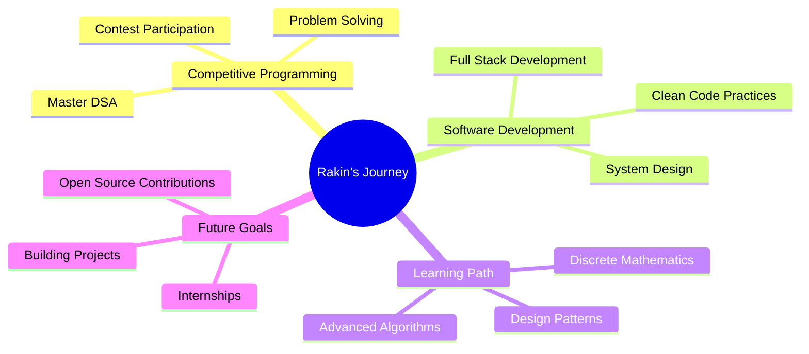

<div align="center">
  
<!-- Animated Header with Custom Gradient -->


<!-- Dynamic Typing Animation -->


<br/>

<!-- Profile Badges with Glow Effect -->


<br/><br/>

<!-- Animated Developer GIF -->


</div>

<br/>

<!-- Rainbow Divider -->


<br/>

##  **About Me**


<br/>

```yaml
name: Rakin
role: Student & Aspiring Developer
location: Bangladesh 🇧🇩
focus: Software Development & Competitive Programming

current_status:
  - 🔭 Working on: Java, Python, Problem Solving
  - 🌱 Learning: Discrete Mathematics, DSA
  - 👯 Open to: Collaboration on CP & Projects
  - 🤝 Seeking help with: Discrete Mathematics
  - 💬 Ask me about: Anything tech-related
  - ⚡ Fun fact: Suffering from both superior 
                 and inferior complex 🤯

interests:
  - Competitive Programming 🏆
  - Software Development 💻
  - Problem Solving 🧩
  - Data Structures & Algorithms 📊
  - Gaming 🎮

motto: "Code with passion, debug with patience"
```

<br clear="right"/>

<!-- Divider -->


##  **Tech Stack & Skills**

<div align="center">

### 💻 **Programming Languages**

<p align="center">
  
</p>

### 🛠️ **Frameworks & Tools**

<p align="center">
  
</p>

### 📚 **Currently Learning**

<p align="center">
  
</p>

### 🎯 **Other Skills**


</div>

<!-- Divider -->


##  **GitHub Stats**

<div align="center">

<!-- GitHub Stats Card with Fire Theme -->


<!-- GitHub Streak Stats -->


<!-- Most Used Languages -->


<!-- GitHub Activity Graph -->


</div>

<!-- Additional Stats Row -->
<div align="center">
  
<br/>

<!-- Trophies -->


</div>

<!-- Divider -->


## 🏆 **Competitive Programming Profiles**

<div align="center">

<!-- CP Platform Badges -->
<a href="https://leetcode.com/try-legendary"></a>
<a href="https://codeforces.com/profile/try_legendary"></a>
<a href="https://www.codechef.com/users/try_legendary"></a>
<a href="https://www.hackerrank.com/try_legendary"></a>

</div>

<!-- Divider -->


## 🐍 **Contribution Snake**

<div align="center">

<!-- Snake eating contributions -->
<picture>
  <source media="(prefers-color-scheme: dark)" srcset="https://raw.githubusercontent.com/try-legendary/try-legendary/output/github-contribution-grid-snake-dark.svg">
  <source media="(prefers-color-scheme: light)" srcset="https://raw.githubusercontent.com/try-legendary/try-legendary/output/github-contribution-grid-snake.svg">
  
</picture>

</div>

<!-- Divider -->


## 🎯 **Current Focus & Goals**

<div align="center">



</div>

<!-- Divider -->


## 📊 **Coding Activity**

<div align="center">

<!-- GitHub Profile Summary Cards -->


<!-- Code Time Badge -->
<br/><br/>


</div>

<!-- Divider -->


## 🤝 **Connect With Me**

<div align="center">

<!-- Social Media Badges -->
<a href="mailto:rakintrying@gmail.com">
  
</a>
<a href="https://www.linkedin.com/in/sk-rakinul-haque-a732283a1/">
  
</a>
<a href="https://www.facebook.com/trylegendary/">
  
</a>
<a href="https://wa.me/8801974720130">
  
</a>

<br/><br/>

<!-- Quote -->


</div>

<!-- Divider -->


## 💡 **Random Dev Quote**

<div align="center">


</div>

<!-- Divider -->


## 🎮 **Fun Stuff**

<div align="center">

<!-- Joke Card -->


</div>

<!-- Divider -->


<div align="center">

### 💭 **"Talk is cheap. Show me the code." - Linus Torvalds**

<br/>

<!-- Support Badges -->


<br/><br/>

<!-- Footer Wave -->


<!-- Visitor Counter -->
<br/>


### ⭐ **If you like my work, consider giving it a star!** ⭐

</div>
